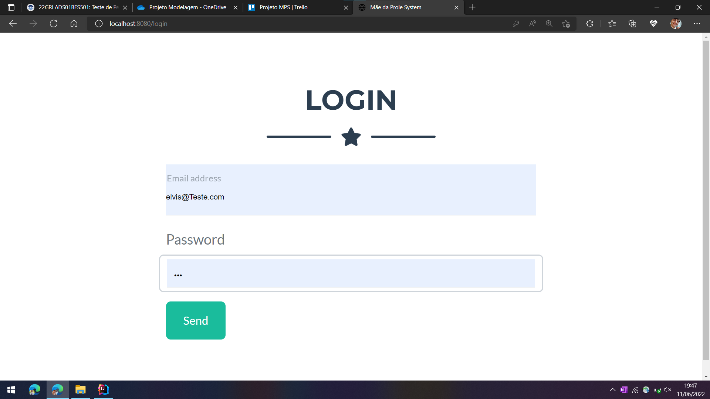

# Projeto Mãe da Prole System (MDPS)

## Projeto de Bloco: Modelagem e Otimização de Sistemas

Este projeto visa propor uma plataforma web para unir doulas e gestantes de maneira simples e ágil.

### Tela inicial

### Cadastro

### Login

### Usuário Autenticado

### Informações do usuário
